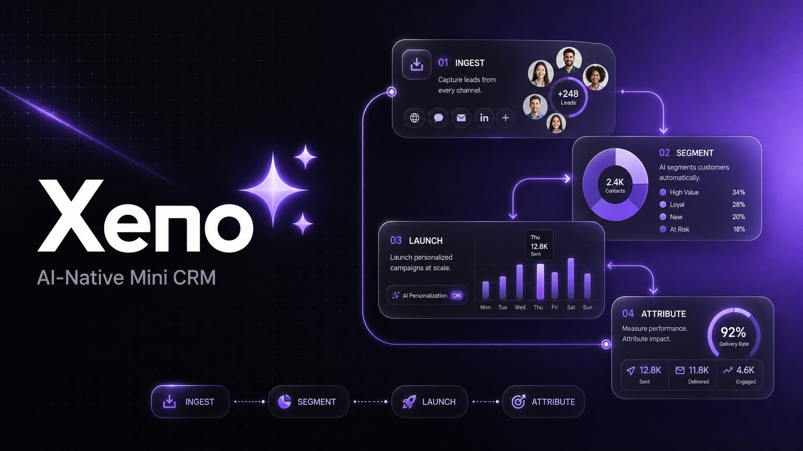
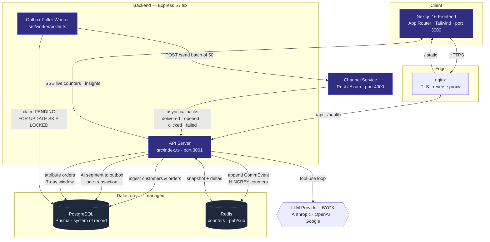

<p align="center">
  
</p>

<h1 align="center">Xeno CRM</h1>

<p align="center">
  <em>An AI-native marketing &amp; engagement Mini CRM — ingest, segment, launch, attribute.</em>
</p>

<p align="center">
  <a href="https://xeno.ansht.tech"></a>
  <a href="https://github.com/Ansh-699/xeno-crm"></a>
  
  
  
</p>

---

## Overview

Xeno CRM is an AI-native marketing CRM for a consumer coffee brand (**"Brewcraft Coffee"**)
that reaches shoppers over **WhatsApp, SMS, Email, and RCS**. Marketers — or the built-in
**AI agent** — ingest customers and orders, carve out behavioural segments in natural
language, and launch personalised campaigns through a **separate stubbed channel service**
that simulates the real async delivery lifecycle and calls back with delivery / engagement
receipts. Live funnel stats, revenue attribution, and AI-written insights close the loop.

The differentiator is the **AI Agent Tool Layer**: CRM operations are exposed as tools the
LLM invokes dynamically, so the agent decides the workflow — *segment → draft → recommend
channels → launch* — from the marketer's intent, with a confirmation gate on irreversible
sends.

```
ingest  →  AI segment  →  outbox  →  worker  →  Rust channel-service
                                                        |
                                                        │  (async callbacks)
                                                        |
insights  ←  attribution  ←  receipts  ←  ◀────────────┘
```

## Architecture

Three runtimes, two managed datastores, BYOK LLM. The backend is **Express 5 (TypeScript via
`tsx`)** split into two processes — an API server and a standalone outbox poller worker. The
channel service is **Rust / Axum**. The frontend is **Next.js 16**. PostgreSQL (via Prisma)
is the system of record; Redis holds live campaign counters and the SSE pub/sub fan-out.



**The end-to-end loop:** `ingest → AI segment → outbox → worker → Rust channel-service →
callback → receipts → attribution → insights`.

Two design patterns make the send path reliable: a **transactional outbox** (campaign rows
and send-intents committed atomically, a separate worker does the HTTP) and an
**append-only event log with monotonic max-rank** receipt handling (out-of-order, duplicate,
and late callbacks are all safe). See the [documentation](https://xeno.ansht.tech/docs) for the
full design.

### Components

| Component | Stack | Port | Role |
|---|---|---|---|
| **Frontend** ([`frontend/`](frontend/)) | Next.js 16 · Tailwind · React 19 | 3000 | Dashboard, AI agent chat, live campaign stats |
| **Backend API** ([`backend/`](backend/)) | Express 5 · TypeScript · Prisma | 3001 | REST + SSE, AI agent tool layer, ingestion |
| **Poller worker** ([`backend/`](backend/)) | same image, worker entrypoint | — | Drains the transactional outbox → channel service |
| **Channel service** ([`channel-service/`](channel-service/)) | Rust · Axum · Tokio | 4000 | Stubbed multi-channel delivery + async callbacks |
| **PostgreSQL** | managed (Neon) | 5432 | System of record |
| **Redis** | managed | 6379 | Live counters + SSE pub/sub |

## Quickstart

Requires Docker, Node.js 20+, and a Rust toolchain.

```bash
# 0. Environment — root .env is consumed by docker-compose (optional server-side AI key)
cp .env.example .env                            # set ANTHROPIC_API_KEY for a default (optional)
cp backend/.env.example backend/.env            # DATABASE_URL, REDIS_URL, CHANNEL_SERVICE_URL
cp frontend/.env.example frontend/.env.local    # NEXT_PUBLIC_API_URL=http://localhost:3001

# 1. Infra — Postgres + Redis
docker compose up -d postgres redis

# 2. Backend deps, Prisma client, migrate + seed (2,000 customers, 8,000 orders)
cd backend
npm install
npm run db:generate
npm run db:migrate
npm run db:seed
cd ..

# 3. Run all services (separate terminals)
cd backend && npm run dev                       # a) API server      :3001
cd backend && npm run worker                    # b) Outbox poller   (background)
cd channel-service && cargo run --release       # c) Channel service :4000
cd frontend && npm install && npm run dev       # d) Frontend        :3000
```

Prefer one command? `./setup.sh` runs steps 1–2 and builds the Rust service; or bring the
**entire stack** (API, poller, channel-service, frontend, one-shot migrate + seed) up with
`docker compose up`.

> **BYOK:** no server-side LLM key is required — users paste their own Anthropic / OpenAI /
> Google key in the UI Settings panel. Without any key, all insight / narrative surfaces fall
> back to data-grounded (non-fabricated) content.

## Deployment

Production runs on a single host with five containers behind nginx + Let's Encrypt, using
**managed Postgres and Redis**. CI builds and tests all three services; a deploy workflow
SSHes in, pulls, rebuilds, applies migrations (never re-seeds), and health-checks.

- [`DEPLOY.md`](DEPLOY.md) — deployment guide (Docker Compose / Railway / Render).
- [`docker-compose.prod.yml`](docker-compose.prod.yml) — production stack (managed datastores).
- [`.github/workflows/`](.github/workflows/) — CI + deploy pipelines.

## Documentation

For full documentation, visit **[https://xeno.ansht.tech/docs](https://xeno.ansht.tech/docs)**

Includes: architecture, design tradeoffs, backend & frontend implementation, API reference.
