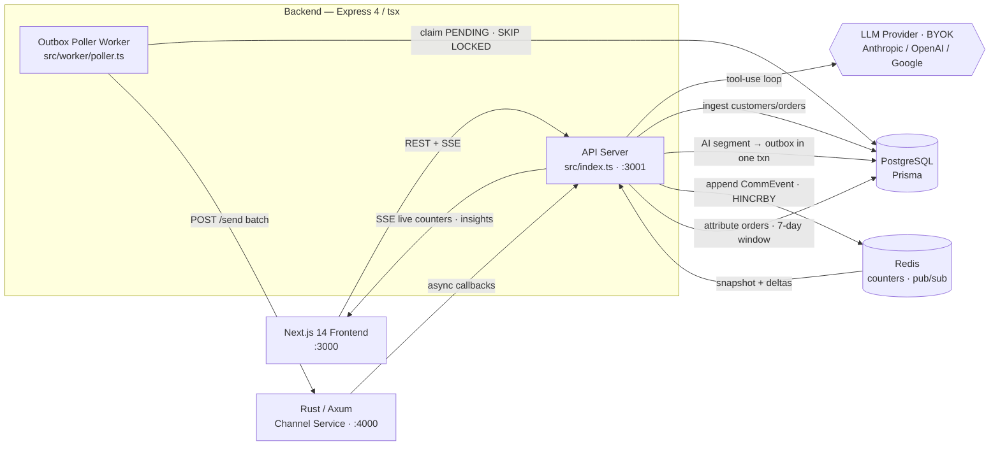

# Xeno CRM

An AI-native marketing/engagement **Mini CRM** for a consumer coffee brand ("Brewcraft
Coffee") that reaches shoppers over WhatsApp, SMS, Email, and RCS. Marketers — or the
built-in AI agent — ingest customers and orders, carve out behavioural segments in natural
language, and launch personalised campaigns through a **separate stubbed channel service**
that simulates the real async delivery lifecycle and calls back with delivery/engagement
receipts. Live funnel stats, attribution, and AI-written insights close the loop. The
differentiator is the **AI Agent Tool Layer**: CRM operations are exposed as tools the LLM
invokes dynamically, so the agent decides the workflow (segment → draft → recommend channels
→ launch) from the marketer's intent, with a confirmation gate on irreversible sends.

## Architecture

The backend is **Express 4 (TypeScript, run via `tsx`)** split into two processes — an API
server and a standalone outbox poller worker. The channel service is **Rust / Axum**. The
frontend is **Next.js 14**. PostgreSQL (via Prisma) is the system of record; Redis holds live
campaign counters and the SSE pub/sub fan-out.



**The loop:** ingest → AI segment → outbox → worker → Rust channel-service → callback →
receipts → attribution → insights.

See [`docs/ARCHITECTURE.md`](docs/ARCHITECTURE.md) for the full design.

## Quickstart

Requires Docker, Node.js 20+, and a Rust toolchain.

```bash
# 0. Environment — root .env is consumed by docker-compose (optional server-side AI key)
cp .env.example .env                       # set ANTHROPIC_API_KEY if you want a default
cp backend/.env.example backend/.env       # DATABASE_URL, REDIS_URL, CHANNEL_SERVICE_URL
cp frontend/.env.example frontend/.env.local   # NEXT_PUBLIC_API_URL=http://localhost:3001

# 1. Infra — Postgres + Redis (and optionally the whole stack)
docker compose up -d postgres redis

# 2. Backend deps, Prisma client, migrate + seed (2,000 customers, 8,000 orders)
cd backend
npm install
npm run db:generate
npm run db:migrate
npm run db:seed
cd ..

# 3. Run all three services (separate terminals)
#    a) Backend API server
cd backend && npm run dev            # :3001
#    b) Outbox poller worker
cd backend && npm run worker         # background sender
#    c) Rust channel service
cd channel-service && cargo run --release   # :4000
#    d) Frontend
cd frontend && npm install && npm run dev   # :3000
```

Prefer one command? `./setup.sh` runs steps 1–2 and builds the Rust service; or bring up the
entire stack (API, poller, channel-service, frontend, one-shot migrate+seed) with
`docker compose up`.

> **BYOK:** no server-side LLM key is required — users paste their own Anthropic / OpenAI /
> Google key in the UI Settings panel. Without any key, all insight/narrative surfaces fall
> back to data-grounded (non-fabricated) content.

## Docs

- [`docs/ARCHITECTURE.md`](docs/ARCHITECTURE.md) — overview, stack, data model, send/receipt
  loop, AI agent layer, ingestion.
- [`docs/TRADEOFFS.md`](docs/TRADEOFFS.md) — design decisions and at-scale evolution.
- [`docs/VERIFICATION.md`](docs/VERIFICATION.md) — reviewer acceptance checklist.
- [`DEPLOY.md`](DEPLOY.md) — deployment (Docker Compose / Railway / Render).
- [`docs/xeno-postman-collection.json`](docs/xeno-postman-collection.json) — API collection.
```
