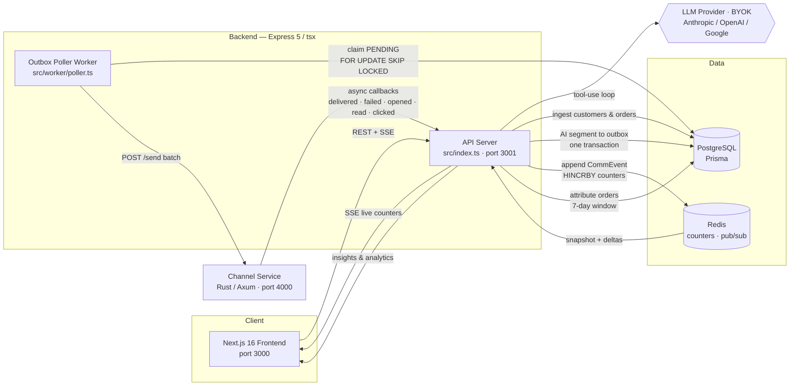

# Architecture

This document is the single source of truth for how Xeno CRM is built: the product
scope, the technology stack, the data model, the send/receipt loop, the AI agent layer,
and the ingestion pipeline. For deployment see [`../DEPLOY.md`](../DEPLOY.md); for design
rationale and scale notes see [`TRADEOFFS.md`](TRADEOFFS.md); for the reviewer acceptance
checklist see [`TRADEOFFS.md`](TRADEOFFS.md).

---

## 1. Overview

### Product

AI-native marketing/engagement Mini CRM for a consumer brand reaching shoppers over
WhatsApp, SMS, Email, and RCS. This is **not** a sales/support CRM — there are no deals,
pipelines, leads, or tickets.

### Minimum Capabilities

1. **Ingest data** — take in customers and their orders, store them.
2. **Segment shoppers** — let the marketer (or the AI) carve out audiences based on
   behaviour and attributes.
3. **Send personalised communications** — dispatch tailored messages to a chosen audience
   through a **separate** stubbed channel service with an async callback loop
   (delivered / failed / opened / read / clicked).
4. **Surface communication performance insights** — track and present how communications
   performed at campaign and/or audience level.

### Architecture Constraint — two services, callback-driven loop

- The CRM exposes a send API. When a campaign goes out, the CRM calls a separate stubbed
  channel service with communication details.
- The channel service simulates outcomes. Asynchronously, it calls back into a CRM receipt
  API with what "happened" to each communication.
- The CRM ingests these callbacks and updates state/stats accordingly.

### Creative Differentiator — AI Agent Tool Layer

Instead of hardcoding an AI workflow, CRM operations are exposed as **tools** the LLM
invokes dynamically via tool-use. The AI decides the workflow (segment, draft, recommend
channels, launch) based on the marketer's natural-language intent, with a confirmation gate
on destructive operations.

### Brand & Seed Data

"Brewcraft Coffee" — an Indian coffee chain. 2,000 customers, 8,000 orders across six
months, with realistic behavioural patterns (loyalists, regulars, at-risk, new, one-time).

### System Diagram



The end-to-end loop: **ingest → AI segment → outbox → worker → Rust channel-service →
callback → receipts → attribution → insights.**

---

## 2. Stack

### CRM Backend — Express 5 REST API (TypeScript / tsx)

- **Framework:** [Express 5](https://expressjs.com/) with TypeScript, run via `tsx`
  (no compilation step in dev).
- **Entry points:** two separate Node.js processes started from the same `backend/`
  directory:
  1. **API server** — `npm run dev` / `npm run start` → `src/index.ts` → `app.listen(3001)`
  2. **Outbox poller worker** — `npm run worker` → `src/worker/poller.ts` (standalone
     long-running process; manages the transactional outbox, sends to the channel service,
     and handles retries)
- **Why Express over Next.js API routes:** the backend is a pure API service (no HTML
  rendering). Express is lighter, lets the worker and the API share the same
  `package.json` / Prisma client without Next.js overhead, and makes the two-process
  topology explicit. SSE and `pg_notify LISTEN` both require long-lived Node.js processes —
  incompatible with serverless/edge runtimes.
- **ORM:** Prisma (PostgreSQL driver), migrations in `backend/prisma/migrations/`.

> **Note:** the frontend is Next.js 16 (see below). The *backend* is **not** Next.js.

### Channel Service — Rust / Axum

- **Framework:** [Axum](https://github.com/tokio-rs/axum) + Tokio (async runtime).
- **Why:** a separate process/container to mirror a real provider boundary (Twilio, Meta
  Cloud API). Compile-time type safety for the channel state machine. The workload is
  I/O-bound (sleep + HTTP callbacks) — Rust's performance advantage is secondary; the
  primary value is demonstrating a polyglot service contract.
- **Crates:** `axum`, `tokio` (full), `reqwest` (rustls-tls), `serde` + `serde_json`,
  `rand`, `dashmap`, `chrono`.

### Database — PostgreSQL via Prisma

Relational data (customers ↔ orders ↔ campaigns ↔ communications) with real FK
constraints. JSONB for flexible segment filters and order products.

### Cache / Pub-Sub — Redis (ioredis)

1. Atomic campaign counters — `HINCRBY campaign:{id} delivered 1`.
2. Pub/Sub for SSE fan-out — `PUBLISH campaign:{id}:updates`.

O(1) hot-path reads on every callback, decoupled from cold analytical queries on Postgres.
Counters are a materialised view — rebuildable from `CommEvent` rows on worker startup.

### AI Layer

- **Three providers implemented:** Anthropic (Claude), OpenAI (GPT-4o), Google (Gemini) —
  all behind a shared `LLMProvider` interface.
- **BYOK (Bring Your Own Key):** credentials travel in HTTP headers per request; never
  logged or persisted server-side.
- **Fallback:** every insight/brief/narrative surface returns data-grounded, non-fabricated
  content when no key is configured.

### Frontend — Next.js 16

- **Framework:** Next.js 16 App Router; **styling:** Tailwind CSS 4.
- **Why Next.js for the frontend only:** the UI benefits from React Server Components and
  static generation. It talks to the Express backend via `NEXT_PUBLIC_API_URL`. There is no
  Next.js API-route backend code.

### Deployment Topology

Not Vercel / serverless — SSE connections, the long-running poller worker, and
`pg_notify LISTEN` all require always-on containers. Five containers + two managed services:

1. `backend` — Express API (port 3001)
2. `poller` — outbox worker (same Docker image, entrypoint `npx tsx src/worker/poller.ts`)
3. `channel-service` — Rust binary (port 4000)
4. `frontend` — Next.js (port 3000)
5. `migrate` — one-shot Prisma migration + seed on deploy
6. PostgreSQL (managed)
7. Redis (managed)

See [`docker-compose.yml`](../docker-compose.yml) for the full service graph and
[`../DEPLOY.md`](../DEPLOY.md) for Railway/Render instructions.

---

## 3. Data Model

### Full Prisma Schema

```prisma
generator client {
  provider = "prisma-client-js"
}

datasource db {
  provider = "postgresql"
  url      = env("DATABASE_URL")
}

model Customer {
  id             String          @id @default(cuid())
  name           String
  email          String?         @unique
  phone          String?
  city           String?
  optedOut       Boolean         @default(false)
  attributes     Json            @default("{}")
  createdAt      DateTime        @default(now())
  orders         Order[]
  communications Communication[]
}

model Order {
  id         String   @id @default(cuid())
  customerId String
  customer   Customer @relation(fields: [customerId], references: [id])
  amount     Float
  products   Json
  channel    String
  orderedAt  DateTime

  @@index([customerId])
  @@index([orderedAt])
}

model Segment {
  id            String   @id @default(cuid())
  name          String
  description   String?
  filters       Json
  aiGenerated   Boolean  @default(false)
  customerCount Int      @default(0)
  campaigns     Campaign[]
  createdAt     DateTime @default(now())
}

model Campaign {
  id              String          @id @default(cuid())
  name            String
  segmentId       String
  segment         Segment         @relation(fields: [segmentId], references: [id])
  goal            String?
  status          String          @default("draft")
  messages        Json
  channelStrategy String          @default("per_customer")
  channel         String?
  totalRecipients Int             @default(0)
  launchToken     String?         @unique
  aiBrief         String?
  aiDecisionLog   Json?
  createdAt       DateTime        @default(now())
  completedAt     DateTime?
  communications  Communication[]

  @@index([status])
}

model Communication {
  id           String      @id @default(cuid())
  campaignId   String
  campaign     Campaign    @relation(fields: [campaignId], references: [id])
  customerId   String
  customer     Customer    @relation(fields: [customerId], references: [id])
  channel      String
  destination  String
  content      String
  status       String      @default("pending")
  sentAt       DateTime?
  deliveredAt  DateTime?
  openedAt     DateTime?
  readAt       DateTime?
  clickedAt    DateTime?
  failedAt     DateTime?
  events       CommEvent[]

  @@index([campaignId])
  @@index([customerId])
}

model CommEvent {
  id              String        @id @default(cuid())
  communicationId String
  communication   Communication @relation(fields: [communicationId], references: [id])
  status          String
  timestamp       DateTime
  createdAt       DateTime      @default(now())

  @@unique([communicationId, status])
  @@index([communicationId])
}

model Outbox {
  id          BigInt   @id @default(autoincrement())
  eventType   String
  aggregateId String
  campaignId  String
  payload     Json
  status      String   @default("PENDING")
  attempts    Int      @default(0)
  maxAttempts Int      @default(5)
  nextRetryAt DateTime @default(now())
  processedAt DateTime?
  error       String?
  createdAt   DateTime @default(now())

  @@index([nextRetryAt])
  @@index([campaignId, status])
}

model AgentRun {
  id          String   @id @default(cuid())
  messages    Json
  status      String   @default("active")
  pendingTool Json?
  createdAt   DateTime @default(now())
  updatedAt   DateTime @updatedAt
}

model ChannelDecision {
  id         String   @id @default(cuid())
  segmentId  String
  customerId String
  channel    String
  reason     String
  createdAt  DateTime @default(now())

  @@unique([segmentId, customerId])
  @@index([segmentId])
}
```

### Field Semantics

**Customer**
- `email` — optional. WhatsApp/SMS-only customers exist. Postgres allows multiple NULLs
  under a unique index.
- `phone` — optional. Email-only customers exist.
- `optedOut` — marketing consent flag. Opted-out customers are excluded at campaign launch.
- `attributes` — flexible JSONB for age, gender, preferences, etc. Queryable via segment DSL.

**Campaign**
- `status` — lifecycle: `draft` | `queued` | `sending` | `completed` | `failed`.
- `messages` — JSON object with merge-field templates per channel:
  `{ "whatsapp": "Hi {{name}}...", "email": "...", ... }`.
- `channelStrategy` — `"per_customer"` (AI picks best channel per customer from
  ChannelDecision) or `"single"` (one channel for all, specified in `channel`).
- `channel` — used only when `channelStrategy = "single"`.
- `launchToken` — idempotency token (semantic hash). Prevents double-launch on
  double-confirm or agent retry.
- `aiBrief` — AI-generated performance analysis (populated on-demand via
  `analyze_performance`).
- `aiDecisionLog` — records why the AI made decisions (channel distribution, exclusions).

**Communication**
- `destination` — snapshot of the customer's email or phone at creation time. Immutable
  after creation (protects against the customer record changing later).
- `content` — hydrated per-customer message (merge fields resolved at launch time).
- `status` — denormalised derived field (max-rank of events from CommEvent).
  **Not** the source of truth.

**CommEvent**
- Append-only event log. Source of truth for the communication lifecycle.
- `@@unique([communicationId, status])` — one event per (communication, status) pair.
  The unique constraint is the concurrency-safe idempotency guard (catch Prisma P2002 →
  return 200).

**Outbox**
- `status` — `PENDING` | `PROCESSING` | `SENT` | `DEAD_LETTER`.
- `campaignId` — denormalised for efficient completion queries (indexed). Avoids LIKE on
  `aggregateId`.
- `nextRetryAt` — enables exponential backoff without a separate scheduling system.

**AgentRun**
- Persists the full LLM message history for resume-after-confirmation.
- `status` — `active` | `awaiting_confirmation` | `completed`.
- `pendingTool` — JSON `{ name, input, toolUseId }` when paused at the confirmation gate.
- TTL: 24 hours. Pruned by periodic cleanup.

**ChannelDecision**
- Staging table for per-customer channel recommendations.
- Produced by `recommend_channels`, consumed by `launch_campaign`.
- Upsert semantics — re-running `recommend_channels` on the same segment updates existing
  rows.

---

## 4. Send / Receipt Loop

### Pattern 1: Transactional Outbox (reliable send)

**Problem — dual write.** If campaign launch creates communication rows *and* sends HTTP in
sequence, a crash between them creates inconsistent state.

**Solution.** Write both communications *and* send-intents in **one** Postgres transaction.
A separate worker process reads the outbox and does the HTTP.

```sql
BEGIN;
  INSERT INTO communications (...) VALUES (...);  -- N rows
  INSERT INTO outbox (...) VALUES (...);          -- N events
COMMIT;
-- Either both persist or neither does.
```

**Outbox partial index:**

```sql
CREATE INDEX idx_outbox_pending ON outbox (next_retry_at)
  WHERE status = 'PENDING';
```

Only covers PENDING rows. PROCESSING is deliberately excluded (the reaper handles those).

**Poller logic (separate Node.js worker process):**

1. **Short-claim transaction:** `SELECT ... FOR UPDATE SKIP LOCKED` → mark rows
   `PROCESSING` → COMMIT (releases the lock immediately).
2. **HTTP POST batch of 50** to the channel service `/send` — *outside* the transaction
   (no lock held during network I/O).
3. **On success:** mark `SENT`, set `processedAt`. If `Campaign.status` is still `queued`,
   set it to `sending`.
4. **On failure:**
   - `attempts < maxAttempts`: reset to `PENDING`, set `nextRetryAt` with exponential
     backoff (`min(5000ms * 2^attempts, 300_000ms)`).
   - `attempts >= maxAttempts`: mark `DEAD_LETTER`, then write a synthetic
     `CommEvent(status='failed')`, set `Communication.status = 'failed'` + `failedAt`, and
     `HINCRBY` the Redis `failed` counter. Prevents zombie communications stuck at
     "pending" forever.
5. **Wakeup:** `pg_notify('outbox_new')` trigger via a dedicated `pg.Client` connection
   (the Prisma pool cannot do LISTEN) + a fallback 5-second polling interval.
6. **After each batch + on a periodic 10-second sweep:** check campaign completion.

**Reaper for stuck PROCESSING rows** (worker startup + every 60s):

```sql
UPDATE outbox SET status = 'PENDING', next_retry_at = NOW()
WHERE status = 'PROCESSING'
AND "processingAt" < NOW() - INTERVAL '60 seconds';
```

Handles the case where the worker crashes after claiming rows but before completing the
HTTP. Short-claim + reaper (rather than holding the DB transaction open across HTTP) avoids
pinning a connection / blocking other pollers during network I/O.

### Pattern 2: Append-only event log + monotonic max-rank receipt handler

**Problem.** Callbacks can arrive out of order (network reordering) or duplicated (retries).
A strict state machine that rejects "invalid transitions" *loses* events.

**Solution — log-as-truth + derived status.** `CommEvent` is append-only. It records every
unique `(communicationId, status)` event regardless of arrival order. The communication's
current status is derived as the highest-rank event seen so far, with `failed` as a terminal
override.

```typescript
const STATUS_RANK: Record<string, number> = {
  pending: 0,
  sent: 1,
  delivered: 2,
  opened: 3,
  read: 3,     // WhatsApp equivalent of opened — same rank
  clicked: 4,
};
// failed is NOT in this map — it's a terminal override handled separately
```

**Receipt handler logic:**

```typescript
async function handleReceipt(receipt: { communicationId, status, timestamp }) {
  // Step 1: Verify communication exists (only 4xx case)
  const comm = await db.communication.findUnique({ where: { id: receipt.communicationId } });
  if (!comm) return { status: 404 };

  // Step 2: If already failed → DISCARD (return 200, do NOT log, do NOT count).
  // Keeps live Redis counters and rebuild-from-comm_events perfectly aligned.
  if (comm.status === 'failed') return { status: 200 };

  // Step 3: Insert event into append-only log.
  // The @@unique([communicationId, status]) constraint is the REAL idempotency guard.
  try {
    await db.commEvent.create({
      data: {
        communicationId: receipt.communicationId,
        status: receipt.status,
        timestamp: receipt.timestamp,
      }
    });
  } catch (e) {
    if (isPrismaUniqueViolation(e)) return { status: 200 }; // duplicate — already processed
    throw e;
  }

  // Step 4: Derive status update
  if (receipt.status === 'failed') {
    // FAILED is terminal — always overrides regardless of current rank
    await db.communication.update({
      where: { id: receipt.communicationId },
      data: { status: 'failed', failedAt: receipt.timestamp },
    });
  } else {
    // Happy path: advance only if newRank > currentRank (monotonic max)
    const newRank = STATUS_RANK[receipt.status] ?? 0;
    const currentRank = STATUS_RANK[comm.status] ?? 0;
    if (newRank > currentRank) {
      await db.communication.update({
        where: { id: receipt.communicationId },
        data: { status: receipt.status, [`${receipt.status}At`]: receipt.timestamp },
      });
    }
  }

  // Step 5: Hot-path — Redis counter + pub/sub (only fires for NEW events)
  await redis.hincrby(`campaign:${comm.campaignId}`, receipt.status, 1);
  await redis.publish(`campaign:${comm.campaignId}:updates`, JSON.stringify(receipt));

  return { status: 200 };
}

function isPrismaUniqueViolation(e: unknown): boolean {
  return (e as any)?.code === 'P2002';
}
```

**Key properties**
- **Never rejects a known event.** Always returns 200; the channel service never
  dead-letters a valid callback.
- **Order-independent.** `opened` before `delivered` → both logged; status = max(opened).
  Late `delivered` is logged but doesn't regress.
- **Failed is terminal and final.** Once failed, late events are discarded (not logged),
  keeping live Redis counters and rebuild-from-comm_events aligned.
- **Concurrent-safe.** `@@unique` catches the race; P2002 → 200; no 500s.
- **Rebuildable.** Status = `failed` if any failed event exists, else max-rank of all logged
  events.

### Channel Service (Rust)

**Endpoints**
- `POST /send` — receive a batch of messages, return 202 Accepted immediately.
- `GET /health` — liveness check.
- `GET /config` — current channel rates (env-configurable).

**Channel-aware event sequences**

| Channel  | Sequence                          | Timing                       | Rates                              |
|----------|-----------------------------------|------------------------------|------------------------------------|
| WhatsApp | sent → delivered → read → clicked | 1-3s deliver, 5-30s read     | 80% deliver, 65% read, 30% click   |
| Email    | sent → delivered → opened → clicked | 5-30s deliver, 60-300s open | 95% deliver, 25% open, 15% click   |
| SMS      | sent → delivered                  | 1-5s deliver                 | 90% deliver                        |
| RCS      | sent → delivered → opened → clicked | 2-5s deliver, 10-45s open   | 85% deliver, 60% open, 25% click   |

Each transition is probabilistic. Failed can occur at any delivery step (replaces delivered).

**Behaviour**
- Callbacks sent individually (not batched) — enables real-time SSE UX.
- Retry on CRM callback failure: 3 attempts, exponential backoff (1s, 4s, 16s). After max
  retries: log + skip (the CRM always returns 200 for known comms, so persistent failure
  means the CRM is truly down).
- Backpressure: `tokio::sync::Semaphore` bounds concurrent tasks to 500.
- Dedup: in-memory `DashMap` with TTL on `idempotency_key`. Loses state on restart —
  acceptable because the CRM receipt handler is idempotent.
- **SSRF guard on callbacks:** `is_callback_allowed` rejects loopback, IPv6 link-local
  (`fe80::/10`), and IPv6 unique-local (`fc00::/7`) targets in addition to host allow-listing.
- Each message spawns a Tokio task that sleeps channel-specific random durations between
  state transitions.

```rust
enum MessageStatus {
    Sent,
    Delivered,
    Failed,
    Opened,  // Email, RCS
    Read,    // WhatsApp
    Clicked, // WhatsApp, Email, RCS
}
```

Transitions are channel-aware — the simulator never emits `Read` for Email or `Opened` for
WhatsApp.

### Campaign completion

A campaign is `completed` when **zero Outbox rows remain in PENDING or PROCESSING** for that
campaign.

```sql
SELECT COUNT(*) FROM outbox WHERE campaign_id = $1 AND status NOT IN ('SENT', 'DEAD_LETTER');
```

- Uses the denormalised `campaignId` column (not LIKE on `aggregateId`).
- Checked after each batch + on a periodic 10-second sweep. Idempotent.
- count = 0 and all communications `failed` → `Campaign.status = 'failed'`.
- count = 0 and at least one succeeded → `Campaign.status = 'completed'`, set `completedAt`.

### Redis counter durability

Redis counters (`campaign:{id}` hash) are a **materialised view** of `comm_events`, not the
source of truth.

```typescript
async function rebuildCampaignCounters(campaignId: string) {
  const counts = await db.commEvent.groupBy({
    by: ['status'],
    where: { communication: { campaignId } },
    _count: true,
  });
  const hash = Object.fromEntries(counts.map(c => [c.status, c._count]));
  await redis.del(`campaign:${campaignId}`);
  if (Object.keys(hash).length > 0) {
    await redis.hset(`campaign:${campaignId}`, hash);
  }
}
```

`HINCRBY` is not in the same transaction as the CommEvent insert; a crash between them
under-counts. The rebuild on worker startup self-heals this drift.

### SSE (Server-Sent Events)

**Subscribe-first pattern** (prevents missing events between snapshot read and subscribe):

1. **Subscribe** to Redis pub/sub channel `campaign:{id}:updates` first.
2. **Read** the current counter snapshot from Redis hash `campaign:{id}`.
3. **Flush** the snapshot to the client as the initial event.
4. **Stream** subsequent pub/sub messages as delta events.

Runs on a long-lived Node.js process (not edge). A shared Redis subscriber per process +
in-process EventEmitter; listeners are removed on connection close.

---

## 5. AI Agent Layer

### Tools (11 total)

| # | Name | Description | requiresConfirmation |
|---|------|-------------|---------------------|
| 1 | `describe_schema` | Get queryable fields, operators, and data shape for segmentation. | false |
| 2 | `query_customers` | Query customers with filters. Returns count + sample rows. | false |
| 3 | `create_segment` | Create a named segment from filter criteria (DSL). | false |
| 4 | `preview_audience` | Preview customers in a segment with sample profiles + count. | false |
| 5 | `draft_messages` | Generate channel-specific messages with merge fields for a segment. | false |
| 6 | `recommend_channels` | Recommend best channel per customer based on engagement history. Upserts ChannelDecision. | false |
| 7 | `launch_campaign` | Launch a campaign to a segment. Requires a stable launchToken (semantic hash). | **true** |
| 8 | `get_campaign_stats` | Get real-time campaign delivery stats from Redis counters. | false |
| 9 | `analyze_performance` | Generate an AI analysis of campaign results. On-demand. | false |
| 10 | `compare_campaigns` | Compare metrics across multiple campaigns. | false |
| 11 | `get_segment_analytics` | Analyse historical performance of campaigns sent to a segment. | false |

### Agent loop with persistent AgentRun

> The pseudo-code below is illustrative of the control flow and invariants. The real loop
> calls `provider.generate({ system, messages, tools })` once per turn (non-streaming) and
> reads `toolUses` / `stopReason` from the response to decide whether to run a tool, pause at
> the confirmation gate, or finish — see the Provider Abstraction section.

```typescript
async function* agentLoop(runId: string, input: { userMessage?: string; approved?: boolean }) {
  let run = await loadRun(runId);

  if (input.userMessage) {
    run.messages.push({ role: "user", content: input.userMessage });
    run.status = 'active';
  } else if (input.approved !== undefined && run.pendingTool) {
    if (input.approved) {
      const result = await executeTool(run.pendingTool.name, run.pendingTool.input);
      run.messages.push({
        role: "user",
        content: [{ type: "tool_result", tool_use_id: run.pendingTool.toolUseId, content: JSON.stringify(result) }]
      });
      yield { type: "tool_result", name: run.pendingTool.name, output: result };
    } else {
      run.messages.push({
        role: "user",
        content: [{ type: "tool_result", tool_use_id: run.pendingTool.toolUseId, content: "User rejected this action.", is_error: true }]
      });
    }
    run.pendingTool = undefined;
    run.status = 'active';
  }

  while (run.status === 'active') {
    for await (const event of provider.streamWithTools(run.messages, CRM_TOOLS)) {
      if (event.type === "text") yield event;
      if (event.type === "tool_call") {
        const tool = CRM_TOOLS.find(t => t.name === event.name);
        run.messages.push({
          role: "assistant",
          content: [{ type: "tool_use", id: event.id, name: event.name, input: event.input }]
        });

        if (tool.requiresConfirmation) {
          run.status = 'awaiting_confirmation';
          run.pendingTool = { name: event.name, input: event.input, toolUseId: event.id };
          await saveRun(run);
          yield { type: "confirmation_required", tool: event.name, input: event.input, runId: run.id };
          return;
        }

        const result = await executeTool(event.name, event.input);
        run.messages.push({
          role: "user",
          content: [{ type: "tool_result", tool_use_id: event.id, content: JSON.stringify(result) }]
        });
        yield { type: "tool_result", name: event.name, output: result };
      }
      if (event.type === "done") { run.status = 'completed'; break; }
    }
  }
  await saveRun(run);
}
```

**Critical invariants**
- Full message history persisted in `AgentRun` — resume loads complete context.
- The assistant `tool_use` block is recorded *before* execution (so it's in history if we
  pause).
- On rejection: a `tool_result` with `is_error: true` — the model adjusts its plan without
  re-running prior tools.
- On approval: the tool executes, the result is appended, and the loop continues naturally.

### `launch_campaign` idempotency

`launch_campaign` derives a **stable** `launchToken` from the logical intent — a SHA-256
hash of `segmentId : name : JSON(messages)` — rather than minting a fresh UUID per call. The
token is checked before the campaign is created:

```typescript
async function executeLaunchCampaign(input: LaunchInput) {
  const launchToken = sha256(`${input.segmentId}:${input.name}:${JSON.stringify(input.messages)}`);

  const existing = await db.campaign.findUnique({ where: { launchToken } });
  if (existing) return { campaignId: existing.id, alreadyLaunched: true };

  return await db.$transaction(async (tx) => { /* campaign + communications + outbox */ });
}
```

Because the token is derived from the request, a double-click, agent retry, resumed
`AgentRun`, network replay, or the model re-emitting the same tool call all collapse to the
**same** token — the idempotency check returns the original campaign instead of duplicating
the send.

### Personalisation: merge-field templates

`Campaign.messages` stores templates with `{{merge_fields}}`. When creating Communication
rows, each template is hydrated per-customer:

- `{{name}}` → customer.name
- `{{top_product}}` → most-ordered product from their orders
- `{{city}}` → customer.city
- `{{days_since_last_order}}` → days since their last order
- `{{total_orders}}` → count of their orders

**Fallbacks for missing data (never render "undefined"):**
- `top_product` → `"a Brewcraft favourite"`
- `city` → omit the clause entirely
- `days_since_last_order` → omit the clause entirely
- `total_orders` → `"0"`
- `name` → `"there"`

Merge-field data is computed with **grouped queries, not an N+1 loop** — a single query per
field across all recipients.

### Launch rules

The audience is the segment's **current members** — not the ChannelDecision rows
(ChannelDecision is a lookup/enrichment layer).

```
for each customer in segment.currentMembers:
  if customer.optedOut → exclude (count as opted_out)
  determine channel:
    if channelStrategy == 'single' → use campaign.channel
    if channelStrategy == 'per_customer':
      look up ChannelDecision for (segmentId, customerId)
      if found → use decision.channel
      if not found → use default contactable channel (best available)
  verify contactability:
    if channel requires phone (whatsapp/sms/rcs) AND customer.phone is null → try fallback
    if channel requires email AND customer.email is null → try fallback
    if NO contactable channel available → exclude (count as unreachable)
  verify template exists:
    if campaign.messages[channel] is undefined → try fallback channel with template
    if no channel has both template AND contactability → exclude (count as unreachable)
  create Communication with resolved channel + hydrated content + destination snapshot
```

**Contactability guard**

```typescript
const CHANNEL_REQUIREMENTS: Record<string, 'phone' | 'email'> = {
  whatsapp: 'phone',
  sms: 'phone',
  rcs: 'phone',
  email: 'email',
};
```

**Channel fallback order** when the preferred channel is unavailable (no address or no
template): `whatsapp → email → sms → rcs`.

**Exclusion reporting** — launch returns a breakdown stored in `Campaign.aiDecisionLog`:

```json
{
  "campaignId": "...",
  "launched": 1850,
  "excluded": { "optedOut": 120, "unreachable": 30 },
  "channelDistribution": { "whatsapp": 1200, "email": 500, "sms": 150 }
}
```

`recommend_channels` re-runs use upsert (update existing ChannelDecision if present, else
create). Never throws on the `@@unique` constraint.

### AI Provider Abstraction (BYOK, multi-provider)

The agent is provider-agnostic. The user supplies their own key per request (BYOK) via the
UI Settings panel; credentials travel in HTTP headers and are never logged or persisted
server-side. `makeProvider(creds)` returns the right adapter for `anthropic`, `openai`, or
`google` — **all three are implemented**.

```typescript
type LLMProviderName = "anthropic" | "openai" | "google";

interface LLMProvider {
  generate(opts: {
    system: string;
    messages: LLMMessage[];
    tools: LLMToolDef[];
    maxTokens?: number;
  }): Promise<LLMResponse>;
}

interface LLMResponse {
  text: string;
  toolUses: Array<{ id: string; name: string; input: any }>;
  stopReason: string;
}

function makeProvider(creds: LLMCredentials): LLMProvider {
  switch (creds.provider) {
    case "anthropic": return anthropicProvider(creds.apiKey, creds.model);
    case "openai":    return openaiProvider(creds.apiKey, creds.model);
    case "google":    return googleProvider(creds.apiKey, creds.model);
  }
}
```

- The agent loop calls `provider.generate(...)` per turn and inspects `toolUses` /
  `stopReason` — a normalised, non-streaming tool-calling contract shared across all three
  providers.
- The Google adapter sanitises tool schemas to Gemini's OpenAPI subset (strips
  `additionalProperties`, `$schema`, etc.) so the same tool definitions work everywhere.
- The app is fully functional **without** any LLM key: insight/narrative/brief surfaces fall
  back to data-grounded, non-fabricated content (including a `source: "starter"` marker on
  template segment suggestions so they aren't passed off as data-driven AI output).

---

## 6. Ingestion

The CRM ingests customers and their orders through two hardened JSON REST endpoints. Both
validate every row, import what is valid, and report what is not — a single bad row never
fails the whole batch.

> CSV upload (`POST /api/customers/import`) still exists for the customer onboarding flow,
> but the canonical, validated ingestion path is the JSON `/bulk` endpoints below.

### `POST /api/customers/bulk`

Body: a JSON **array** of customer objects, each validated with the `CustomerInput` zod
schema (`src/lib/ingest-schemas.ts`):

| field | rule |
| --- | --- |
| `name` | required, trimmed, non-empty |
| `email` | optional, valid email; **uniqueness deduped** at insert |
| `phone` | optional, non-empty |
| `city` | optional, non-empty |
| `optedOut` | optional boolean, defaults `false` |
| `attributes` | optional JSON object, defaults `{}` |

Valid rows are inserted with `createMany({ skipDuplicates: true })`, so customers with a
duplicate `email` are **skipped, not errored**.

```json
{
  "received": 4,
  "imported": 2,
  "skipped": 0,
  "rejected": 2,
  "errors": [
    { "row": 2, "error": "name: Invalid input: expected string, received undefined" },
    { "row": 3, "error": "email: invalid email" }
  ]
}
```

### `POST /api/orders/bulk`

Body: a JSON **array** of order objects, validated with `OrderInput`:

| field | rule |
| --- | --- |
| `customerId` | required; the customer **must exist** |
| `amount` | required number `>= 0` |
| `products` | required; array or object |
| `channel` | required, non-empty |
| `orderedAt` | required; ISO string or Date (coerced) |
| `externalId` | optional; **unique idempotency key** for the source order |

Processing pipeline:

1. **Validate** every row; invalid rows go to `errors[]` with their 1-based row number.
2. **Verify customer linkage** — referenced `customerId`s are looked up in one query; rows
   pointing at an unknown customer are added to `errors[]` (the batch is not aborted by a
   foreign-key violation).
3. **Insert + dedup** — valid rows are written with
   `createManyAndReturn({ skipDuplicates: true })`. A repeated `externalId` is skipped, so
   re-posting the same batch imports once and never double-counts revenue.
4. **Attribute in real time** — each newly inserted order is run through `attributeOrder()`,
   which credits it to the most recent communication **delivered to the same customer within
   the 7-day window** before the order. No separate backfill call is needed for live orders.

```json
{
  "received": 2,
  "imported": 1,
  "skipped": 0,
  "rejected": 1,
  "attributed": 1,
  "errors": [
    { "row": 2, "error": "unknown customerId: ghost-does-not-exist" }
  ]
}
```

### Attribution: live vs. backfill

- **Live** — `/api/orders/bulk` attributes each order as it is ingested.
- **Backfill** — `POST /api/orders/backfill-attribution` re-attributes orders that have no
  attribution yet. It exists for seeded / historical data (orders that predate any
  campaign). It is not needed in the normal live-ingest path.

### Idempotency

`externalId` is the source system's order id. Because it is `@unique`, the same order can be
safely re-ingested any number of times: the first insert wins, later ones are counted under
`skipped`. See [`TRADEOFFS.md`](TRADEOFFS.md) §10 for the at-scale evolution (async consumer
+ same idempotency key).
