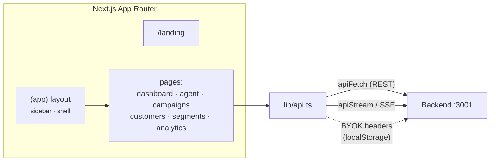

# Frontend — Xeno CRM

Next.js 15 (App Router) dashboard for Xeno CRM, styled with Tailwind CSS. It is a pure
client of the Express backend — there is **no Next.js API-route backend code**. All data
flows over REST + SSE through a thin `lib/api.ts` wrapper. LLM credentials are **BYOK**: the
user's key lives in `localStorage` and is attached as request headers, never sent to or
stored on the server.

> Part of the [Xeno CRM](../README.md) monorepo. Full design in
> [`../docs/ARCHITECTURE.md`](../docs/ARCHITECTURE.md).

## Architecture



`NEXT_PUBLIC_API_URL` (baked at **build time**) points the client at the backend. In
production a reverse proxy serves the frontend at `/` and the backend at `/api`, so
`NEXT_PUBLIC_API_URL=https://xeno.ansht.tech`.

## Structure

```
frontend/
├── public/
│   ├── banner.png           # README / OpenGraph banner
│   └── xeno-favicon.png     # app favicon
├── src/
│   ├── app/
│   │   ├── layout.tsx       # root layout — fonts, theme, metadata (favicon, OG)
│   │   ├── globals.css      # Tailwind base + theme tokens
│   │   ├── landing/         # marketing landing page
│   │   └── (app)/           # authed app shell (route group)
│   │       ├── layout.tsx   # wraps pages in the sidebar shell
│   │       ├── page.tsx     # dashboard — stats, AI insights, recent campaigns
│   │       ├── agent/       # AI agent chat (tool-use, streaming)
│   │       ├── campaigns/   # campaign list + live SSE stats
│   │       ├── customers/   # customer list + CSV / bulk import
│   │       ├── segments/    # segment builder
│   │       └── analytics/   # funnel + performance charts
│   ├── components/
│   │   ├── app-shell.tsx    # top-level layout chrome
│   │   ├── sidebar.tsx      # nav
│   │   ├── AISettings.tsx   # BYOK provider/key panel (localStorage)
│   │   ├── theme-provider.tsx # dark/light, no-flash init
│   │   └── ui/              # buttons, textarea, theme toggle, WebGL shader
│   └── lib/
│       ├── api.ts           # fetch wrapper: apiFetch · apiStream · sseUrl · BYOK headers
│       └── utils.ts         # cn() + helpers
├── next.config.mjs          # output: "standalone" for slim Docker images
└── Dockerfile               # multi-stage standalone build (bakes NEXT_PUBLIC_API_URL)
```

## Data flow

- **`apiFetch<T>(path)`** — typed JSON GET/POST against `NEXT_PUBLIC_API_URL`.
- **`apiStream(path, body)`** — POST returning a stream; used by the AI agent. Maps backend
  errors (missing key, 401/403, 429) to friendly messages.
- **`aiHeaders()`** — reads `xeno.ai` from `localStorage` and attaches `x-llm-provider`,
  `x-llm-api-key`, `x-llm-model` headers (BYOK).
- **Live campaign stats** stream over SSE from the backend's Redis-backed counters.

## Develop

```bash
npm install
cp .env.example .env.local           # NEXT_PUBLIC_API_URL=http://localhost:3001
npm run dev                          # :3000
npm run build && npm run start       # production build (standalone)
```

### Environment

| Var | Example | Notes |
|---|---|---|
| `NEXT_PUBLIC_API_URL` | `http://localhost:3001` | backend base URL — **inlined at build time** |

## Stack

Next.js 15 (App Router) · React 19 · Tailwind CSS 3 · TypeScript 5 · lucide-react · three.js.
